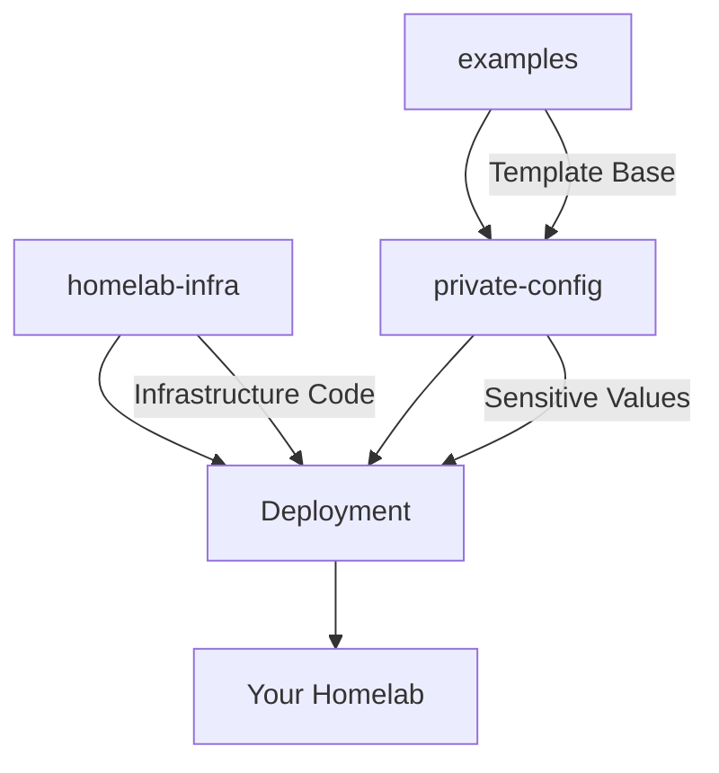

# Repository Architecture

This homelab infrastructure follows a three-repository GitOps architecture for security, maintainability, and reusability.

## Repository Structure

### 1. 🏗️ Main Infrastructure Repository (`homelab-infra`)
**This Repository** - Public infrastructure code and deployment automation

**Contents:**
- Kubernetes manifests (base configurations)
- Ansible playbooks and roles
- Deployment scripts and automation
- Documentation and guides
- Helm chart templates (without sensitive values)

**Purpose:**
- Provides the core infrastructure automation
- Contains reusable deployment patterns
- Includes comprehensive documentation
- Maintains deployment workflows

### 2. 🔐 Private Configuration Repository
**Your Private Repository** - Sensitive configurations and customizations

**Contents:**
- Environment-specific values files
- Secrets and credentials
- Custom Helm values overrides
- Private network configurations
- Personal customizations

**Purpose:**
- Stores sensitive information securely
- Contains environment-specific customizations
- Provides values for your specific deployment
- Keeps private data separate from public code

### 3. 📚 Public Examples Repository (`homelab-infra-examples`)
**Community Examples Repository** - Generic templates and examples

**Contents:**
- Example configuration files
- Sample Helm values files
- Common deployment scenarios
- Best practice templates
- Community contributions

**Purpose:**
- Provides starting templates for new users
- Shows best practices and common patterns
- Enables community sharing of configurations
- Offers different deployment scenarios

## Configuration Flow



## Getting Started

### 1. Clone the Main Repository
```bash
git clone https://github.com/your-org/homelab-infra.git
cd homelab-infra
```

### 2. Create Your Private Configuration Repository
```bash
# Create a new private repository
gh repo create homelab-infra-private --private

# Clone and set up
git clone https://github.com/your-username/homelab-infra-private.git
cd homelab-infra-private

# Copy example configurations
cp -r ../homelab-infra/examples/* .
```

### 3. Configure Environment Variables
```bash
# In homelab-infra/.env
PRIVATE_CONFIG_REPO=https://github.com/your-username/homelab-infra-private.git
PRIVATE_CONFIG_BRANCH=main
PRIVATE_CONFIG_DIR=config
```

### 4. Customize Your Configuration
Edit files in your private repository:
- `config/values/global.yaml` - Global overrides
- `config/values/gitlab.yaml` - GitLab configuration
- `config/values/keycloak.yaml` - Keycloak configuration
- `config/secrets/` - Encrypted secrets

### 5. Deploy
```bash
# The deployment scripts will automatically:
# 1. Use infrastructure code from homelab-infra
# 2. Pull configurations from your private repo
# 3. Apply customizations and deploy

./scripts/deploy-homelab.sh vm-test
```

## Directory Structure

### Main Repository (`homelab-infra`)
```
homelab-infra/
├── ansible/                 # Deployment automation
├── kubernetes/              # Base K8s manifests
├── helm/                    # Helm chart templates
├── scripts/                 # Deployment scripts
├── docs/                    # Documentation
├── .env                     # Public environment variables
└── examples/                # Template configurations
```

### Private Repository (`homelab-infra-private`)
```
homelab-infra-private/
├── config/
│   ├── values/              # Helm values overrides
│   │   ├── global.yaml
│   │   ├── gitlab.yaml
│   │   ├── keycloak.yaml
│   │   └── monitoring.yaml
│   ├── secrets/             # Encrypted secrets
│   │   ├── gitlab-secrets.yaml
│   │   ├── keycloak-secrets.yaml
│   │   └── tls-certificates.yaml
│   └── environments/        # Environment-specific configs
│       ├── development.yaml
│       ├── staging.yaml
│       └── production.yaml
├── .env.private             # Private environment variables
└── README.md                # Private documentation
```

### Examples Repository (`homelab-infra-examples`)
```
homelab-infra-examples/
├── basic-setup/             # Minimal configuration
├── advanced-setup/          # Full-featured configuration
├── cloud-setup/             # Cloud provider configurations
├── edge-setup/              # Edge/IoT configurations
├── development/             # Development environment
├── production/              # Production environment
└── docs/                    # Example documentation
```

## Security Benefits

1. **Separation of Concerns**: Infrastructure code separate from sensitive data
2. **Access Control**: Private repo access limited to authorized users
3. **Public Sharing**: Infrastructure patterns can be shared safely
4. **Version Control**: Sensitive configs tracked separately
5. **GitOps Compliance**: Follows GitOps security best practices

## Deployment Integration

The deployment process automatically:

1. **Loads Environment**: Reads `.env` and private environment variables
2. **Clones Private Config**: Pulls your private configuration repository
3. **Merges Configurations**: Combines base infrastructure with your customizations
4. **Applies Secrets**: Handles encrypted secrets securely
5. **Deploys Stack**: Executes deployment with combined configuration

## Best Practices

### Public Repository (homelab-infra)
- ✅ Include generic configurations
- ✅ Provide comprehensive documentation
- ✅ Use environment variable placeholders
- ❌ Never commit sensitive information
- ❌ Avoid environment-specific hardcoded values

### Private Repository
- ✅ Use encryption for secrets
- ✅ Document your customizations
- ✅ Version control your changes
- ❌ Don't share private repository access
- ❌ Avoid committing plain-text passwords

### Examples Repository
- ✅ Provide working templates
- ✅ Include documentation for each example
- ✅ Show different use cases
- ❌ Don't include real credentials
- ❌ Avoid overly specific configurations

This architecture ensures your homelab deployment is secure, maintainable, and follows GitOps best practices while enabling easy sharing and reuse of infrastructure patterns.
