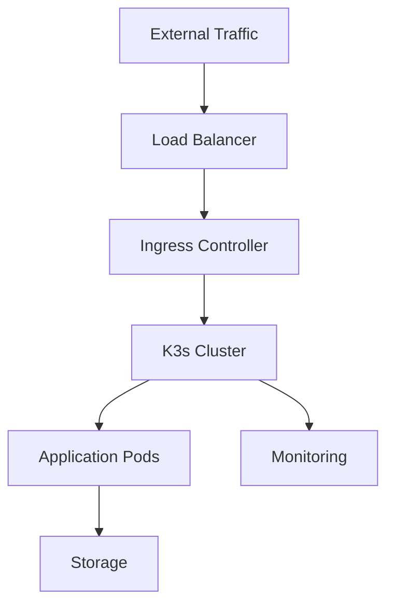

# Homelab Infrastructure Architecture

## Overview
This document outlines the high-level system design and component relationships for the homelab infrastructure project. Detailed configuration and sensitive architecture details are maintained in private documentation.

## Core Components

### 1. Kubernetes Layer (k3s)
- Lightweight Kubernetes distribution
- Optimized for homelab environments
- Custom configuration for security and performance

### 2. Storage Infrastructure
- Distributed block storage system
- Volume replication capabilities
- Backup and restore functionality

### 3. Networking Stack
- Load balancer for service exposure
- Ingress controller for HTTP(S) routing
- Network policy enforcement

### 4. Monitoring & Observability
- Metrics collection and storage
- Log aggregation
- Visualization dashboards

## Security Architecture

### 1. Network Security
- Network policy implementation
- Segmented namespaces
- TLS encryption

### 2. Access Control
- Role-Based Access Control (RBAC)
- Service account management
- Pod security standards

### 3. Secret Management
- Environment-based configuration
- Secure secret storage
- Access control mechanisms

## Component Relationships

## Notes
- Detailed configuration and sensitive architecture details are maintained in private documentation
- For access to complete architecture documentation, please contact the project maintainers
