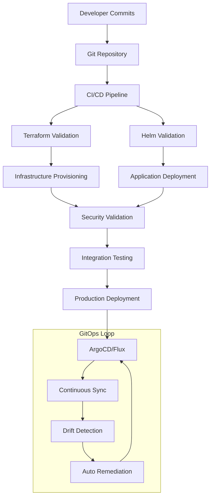

# Unified Deployment Workflows

**Version:** 2.0  
**Date:** December 2024  
**Author:** DevOps Team  

## Overview

This document describes the modernized unified deployment workflows that integrate Terraform, Helm, and GitOps for seamless infrastructure and application management. The unified approach provides consistency, reliability, and automated testing across all deployment scenarios.

## Architecture Overview



## Deployment Strategies

### 1. Unified Script Deployment

The primary deployment method using the integrated script that orchestrates all components:

```bash
# Basic deployment
./scripts/deployment/deploy-unified.sh --environment production

# With specific options
./scripts/deployment/deploy-unified.sh \
  --environment staging \
  --skip-terraform \
  --debug

# Dry run deployment
./scripts/deployment/deploy-unified.sh \
  --environment development \
  --dry-run
```

### 2. Component-Specific Deployment

For targeted deployments when only specific components need updates:

```bash
# Infrastructure only
./scripts/deployment/deploy-unified.sh \
  --environment production \
  --skip-helmfile \
  --skip-tests

# Applications only
./scripts/deployment/deploy-unified.sh \
  --environment production \
  --skip-terraform
```

### 3. GitOps Deployment

Continuous deployment through GitOps tools:

```bash
# ArgoCD deployment
kubectl apply -f deployments/gitops/argocd/app-of-apps.yaml

# Flux deployment
flux bootstrap github \
  --owner=tzervas \
  --repository=homelab-infra \
  --branch=main \
  --path=deployments/gitops/flux
```

## Deployment Phases

### Phase 1: Pre-Deployment Validation

**Duration:** 2-3 minutes  
**Purpose:** Validate prerequisites and configuration

```bash
# Automated checks performed:
# - Tool availability (terraform, helm, kubectl)
# - Kubernetes cluster connectivity
# - Configuration file validation
# - Environment-specific prerequisites

# Manual validation (optional)
python3 scripts/testing/validate_deployment.py --pre-deployment
```

**Key Validations:**

- Terraform state consistency
- Kubernetes cluster health
- Required tools and versions
- Environment configuration
- Network connectivity

### Phase 2: Infrastructure Provisioning (Terraform)

**Duration:** 5-10 minutes  
**Purpose:** Provision and configure infrastructure

```bash
# Terraform workflow:
terraform init
terraform plan -var="environment=$ENVIRONMENT" -out=tfplan
terraform apply tfplan

# Components provisioned:
# - K3s cluster configuration
# - Network policies and MetalLB
# - Security components (cert-manager, sealed-secrets)
# - Storage classes and provisioners
```

**Terraform Modules Applied:**

1. **K3s Cluster Module**: Cluster configuration and node management
2. **Networking Module**: MetalLB, ingress, DNS configuration
3. **Security Module**: Certificate management, RBAC, policies
4. **Storage Module**: Storage classes and provisioners

### Phase 3: Application Deployment (Helm)

**Duration:** 8-15 minutes  
**Purpose:** Deploy applications and services

```bash
# Helmfile workflow:
helmfile --environment $ENVIRONMENT deps
helmfile --environment $ENVIRONMENT sync --wait --timeout 600

# Components deployed (in order):
# 1. Infrastructure tier (metallb, cert-manager, ingress-nginx)
# 2. Storage tier (longhorn)
# 3. Monitoring tier (prometheus, grafana, loki)
# 4. Application tier (custom applications)
```

**Deployment Tiers:**

- **Infrastructure**: Core cluster services
- **Storage**: Persistent volume management
- **Monitoring**: Observability stack
- **Applications**: Business applications

### Phase 4: Security Validation

**Duration:** 3-5 minutes  
**Purpose:** Validate security configurations

```bash
# Security checks performed:
python3 scripts/security/security-policy-compliance-checks.py
python3 scripts/security/tls-configuration-validation.py --check-all
python3 scripts/security/certificate-expiry-monitoring.py --check-expiry
```

**Security Validations:**

- TLS certificate validity and expiration
- Network policy enforcement
- RBAC configuration correctness
- Pod security standards compliance
- Secret encryption and rotation

### Phase 5: Integration Testing

**Duration:** 5-8 minutes  
**Purpose:** Comprehensive system validation

```bash
# Test suite execution:
python3 scripts/testing/test_reporter.py --environment $ENVIRONMENT
./testing/k3s-validation/orchestrator.sh --environment $ENVIRONMENT
python3 scripts/testing/integrated_test_orchestrator.py
```

**Test Categories:**

- Infrastructure health checks
- Service connectivity testing
- Application functionality validation
- Performance baseline verification
- Security compliance validation

## Environment-Specific Workflows

### Development Environment

**Characteristics:**

- Relaxed security policies for easier debugging
- Single-node deployment
- Local storage only
- Self-signed certificates
- Minimal resource allocation

```bash
# Development deployment
./scripts/deployment/deploy-unified.sh \
  --environment development \
  --skip-tests

# Quick iteration deployment
./scripts/deployment/deploy-unified.sh \
  --environment development \
  --skip-terraform \
  --debug
```

**Development-Specific Configuration:**

```yaml
# environments/development/values.yaml
global:
  environment: development
  security:
    enforceNetworkPolicies: false
    useSelfSignedCerts: true
  resources:
    requests:
      cpu: "100m"
      memory: "128Mi"
```

### Staging Environment

**Characteristics:**

- Production-like configuration
- Let's Encrypt staging certificates
- Full monitoring stack
- Multiple replicas for testing
- Network policies enabled

```bash
# Staging deployment with full validation
./scripts/deployment/deploy-unified.sh \
  --environment staging

# Staging-specific testing
./scripts/deployment/deploy-unified.sh \
  --environment staging \
  --skip-terraform \
  python3 scripts/testing/staging_validation.py
```

**Staging-Specific Configuration:**

```yaml
# environments/staging/values.yaml
global:
  environment: staging
  security:
    enforceNetworkPolicies: true
    useLetsEncryptStaging: true
  replicas:
    min: 2
    max: 3
```

### Production Environment

**Characteristics:**

- Strict security policies
- Production Let's Encrypt certificates
- High availability configuration
- Full resource allocation
- Comprehensive monitoring and alerting

```bash
# Production deployment with all safeguards
./scripts/deployment/deploy-unified.sh \
  --environment production

# Production maintenance deployment
./scripts/deployment/deploy-unified.sh \
  --environment production \
  --skip-terraform \
  --maintenance-mode
```

**Production-Specific Configuration:**

```yaml
# environments/production/values.yaml
global:
  environment: production
  security:
    enforceNetworkPolicies: true
    useLetsEncryptProd: true
    enableRuntimeSecurity: true
  replicas:
    min: 3
    max: 5
  resources:
    requests:
      cpu: "500m"
      memory: "1Gi"
    limits:
      cpu: "2000m"
      memory: "4Gi"
```

## GitOps Integration

### ArgoCD Configuration

**App-of-Apps Pattern:**

```yaml
# deployments/gitops/argocd/app-of-apps.yaml
apiVersion: argoproj.io/v1alpha1
kind: Application
metadata:
  name: infrastructure-apps
  namespace: argocd
spec:
  project: default
  source:
    repoURL: https://github.com/tzervas/homelab-infra
    targetRevision: main
    path: deployments/gitops/argocd/applications
  destination:
    server: https://kubernetes.default.svc
    namespace: argocd
  syncPolicy:
    automated:
      prune: true
      selfHeal: true
      allowEmpty: false
    syncOptions:
      - CreateNamespace=true
      - PrunePropagationPolicy=foreground
      - PruneLast=true
```

**Individual Application:**

```yaml
# deployments/gitops/argocd/applications/monitoring.yaml
apiVersion: argoproj.io/v1alpha1
kind: Application
metadata:
  name: monitoring
  namespace: argocd
spec:
  project: default
  source:
    repoURL: https://github.com/tzervas/homelab-infra
    targetRevision: main
    path: helm
    helm:
      valueFiles:
        - environments/production/values-monitoring.yaml
  destination:
    server: https://kubernetes.default.svc
    namespace: monitoring
  syncPolicy:
    automated:
      prune: true
      selfHeal: true
    retry:
      limit: 5
      backoff:
        duration: 5s
        factor: 2
        maxDuration: 3m
```

### Flux Configuration

**Flux Bootstrap:**

```bash
# Install Flux
flux bootstrap github \
  --owner=tzervas \
  --repository=homelab-infra \
  --branch=main \
  --path=deployments/gitops/flux \
  --personal
```

**Flux Kustomization:**

```yaml
# deployments/gitops/flux/clusters/homelab/kustomization.yaml
apiVersion: kustomize.toolkit.fluxcd.io/v1beta2
kind: Kustomization
metadata:
  name: infrastructure
  namespace: flux-system
spec:
  interval: 10m
  sourceRef:
    kind: GitRepository
    name: homelab-infra
  path: "./kubernetes/infrastructure"
  prune: true
  validation: client
  healthChecks:
    - apiVersion: apps/v1
      kind: Deployment
      name: metallb-controller
      namespace: metallb-system
```

## CI/CD Pipeline Integration

### GitHub Actions Workflow

```yaml
# .github/workflows/deploy.yml
name: Deploy Infrastructure

on:
  push:
    branches: [main, develop]
  pull_request:
    branches: [main]

jobs:
  validate:
    runs-on: ubuntu-latest
    steps:
      - uses: actions/checkout@v3

      - name: Setup Tools
        run: |
          # Install terraform, helm, kubectl
          ./scripts/setup/install-tools.sh

      - name: Validate Terraform
        run: |
          cd terraform
          terraform init
          terraform validate
          terraform plan -var="environment=staging"

      - name: Validate Helm
        run: |
          cd helm
          helmfile --environment staging lint
          helmfile --environment staging diff

  deploy-staging:
    needs: validate
    if: github.ref == 'refs/heads/develop'
    runs-on: ubuntu-latest
    environment: staging
    steps:
      - uses: actions/checkout@v3

      - name: Configure kubectl
        uses: azure/k8s-set-context@v1
        with:
          method: kubeconfig
          kubeconfig: ${{ secrets.KUBE_CONFIG_STAGING }}

      - name: Deploy to Staging
        run: |
          ./scripts/deployment/deploy-unified.sh \
            --environment staging

      - name: Run Tests
        run: |
          python3 scripts/testing/test_reporter.py \
            --environment staging \
            --output-format json > test-results.json

      - name: Upload Test Results
        uses: actions/upload-artifact@v3
        with:
          name: test-results-staging
          path: test-results.json

  deploy-production:
    needs: [validate, deploy-staging]
    if: github.ref == 'refs/heads/main'
    runs-on: ubuntu-latest
    environment: production
    steps:
      - uses: actions/checkout@v3

      - name: Configure kubectl
        uses: azure/k8s-set-context@v1
        with:
          method: kubeconfig
          kubeconfig: ${{ secrets.KUBE_CONFIG_PRODUCTION }}

      - name: Deploy to Production
        run: |
          ./scripts/deployment/deploy-unified.sh \
            --environment production

      - name: Verify Deployment
        run: |
          python3 scripts/testing/production_health_check.py

      - name: Notify Success
        if: success()
        run: |
          curl -X POST ${{ secrets.SLACK_WEBHOOK }} \
            -H 'Content-type: application/json' \
            --data '{"text":"✅ Production deployment successful"}'

      - name: Notify Failure
        if: failure()
        run: |
          curl -X POST ${{ secrets.SLACK_WEBHOOK }} \
            -H 'Content-type: application/json' \
            --data '{"text":"❌ Production deployment failed"}'
```

### GitLab CI/CD Pipeline

```yaml
# .gitlab-ci.yml
stages:
  - validate
  - deploy-staging
  - test-staging
  - deploy-production
  - verify-production

variables:
  TERRAFORM_VERSION: "1.6.0"
  HELM_VERSION: "3.13.0"

before_script:
  - ./scripts/setup/install-tools.sh

validate:
  stage: validate
  script:
    - ./scripts/deployment/deploy-unified.sh --dry-run --environment staging
  rules:
    - if: $CI_COMMIT_BRANCH

deploy-staging:
  stage: deploy-staging
  environment:
    name: staging
    url: https://staging.homelab.local
  script:
    - ./scripts/deployment/deploy-unified.sh --environment staging
  rules:
    - if: $CI_COMMIT_BRANCH == "develop"

test-staging:
  stage: test-staging
  script:
    - python3 scripts/testing/test_reporter.py --environment staging
  artifacts:
    reports:
      junit: test-results.xml
  rules:
    - if: $CI_COMMIT_BRANCH == "develop"

deploy-production:
  stage: deploy-production
  environment:
    name: production
    url: https://homelab.local
  script:
    - ./scripts/deployment/deploy-unified.sh --environment production
  rules:
    - if: $CI_COMMIT_BRANCH == "main"
  when: manual

verify-production:
  stage: verify-production
  script:
    - python3 scripts/testing/production_health_check.py
    - python3 scripts/testing/integration_tester.py --environment production
  rules:
    - if: $CI_COMMIT_BRANCH == "main"
```

## Monitoring and Observability

### Deployment Metrics

```yaml
# monitoring/deployment-metrics.yaml
apiVersion: v1
kind: ConfigMap
metadata:
  name: deployment-metrics
  namespace: monitoring
data:
  prometheus-rules.yaml: |
    groups:
    - name: deployment.rules
      rules:
      - alert: DeploymentDuration
        expr: deployment_duration_seconds > 900
        for: 0m
        labels:
          severity: warning
        annotations:
          summary: "Deployment taking longer than expected"
          description: "Deployment {{ $labels.environment }} has been running for {{ $value }} seconds"

      - alert: DeploymentFailure
        expr: deployment_success == 0
        for: 0m
        labels:
          severity: critical
        annotations:
          summary: "Deployment failed"
          description: "Deployment {{ $labels.environment }} has failed"
```

### Grafana Dashboard

```json
{
  "dashboard": {
    "title": "Deployment Overview",
    "panels": [
      {
        "title": "Deployment Success Rate",
        "type": "stat",
        "targets": [
          {
            "expr": "rate(deployment_success_total[1h])"
          }
        ]
      },
      {
        "title": "Deployment Duration",
        "type": "graph",
        "targets": [
          {
            "expr": "deployment_duration_seconds"
          }
        ]
      },
      {
        "title": "Environment Status",
        "type": "table",
        "targets": [
          {
            "expr": "deployment_last_success_timestamp"
          }
        ]
      }
    ]
  }
}
```

## Troubleshooting

### Common Issues

#### 1. Terraform State Lock

**Symptoms:** Terraform operations fail with state lock error
**Solution:**

```bash
# Check lock status
terraform force-unlock LOCK_ID

# Identify lock holder
terraform show terraform.tfstate | grep serial

# Safely unlock if needed
terraform force-unlock LOCK_ID -force
```

#### 2. Helm Release Conflicts

**Symptoms:** Helm deployment fails with existing release
**Solution:**

```bash
# Check existing releases
helm list -A

# Rollback problematic release
helm rollback release-name revision-number

# Force upgrade if necessary
helm upgrade release-name chart-name --force
```

#### 3. GitOps Sync Issues

**Symptoms:** ArgoCD/Flux not syncing applications
**Solution:**

```bash
# ArgoCD troubleshooting
argocd app sync app-name --force
argocd app get app-name

# Flux troubleshooting
flux get kustomizations
flux reconcile kustomization flux-system
```

#### 4. Certificate Issues

**Symptoms:** TLS certificates not being issued
**Solution:**

```bash
# Check cert-manager status
kubectl get certificates -A
kubectl describe certificate certificate-name

# Check issuer status
kubectl get clusterissuers
kubectl describe clusterissuer letsencrypt-prod

# Force certificate renewal
kubectl annotate certificate certificate-name cert-manager.io/force-renew=true
```

### Debug Commands

```bash
# Enable debug logging for unified deployment
DEBUG=true ./scripts/deployment/deploy-unified.sh --environment development

# Check deployment status
kubectl get pods -A
kubectl get services -A
kubectl get ingresses -A

# Validate network connectivity
kubectl run debug-pod --image=busybox:1.28 --rm -it --restart=Never -- nslookup kubernetes.default

# Check logs
kubectl logs -n kube-system -l app=k3s
kubectl logs -n metallb-system -l app=metallb
kubectl logs -n cert-manager -l app=cert-manager
```

## Performance Optimization

### Deployment Speed Optimization

1. **Parallel Execution**: Use Terraform and Helm parallelism
2. **Incremental Updates**: Skip unchanged components
3. **Resource Pre-allocation**: Pre-create necessary resources
4. **Caching**: Use container registry caching

```bash
# Optimized deployment command
./scripts/deployment/deploy-unified.sh \
  --environment production \
  --parallel \
  --incremental \
  --cache-images
```

### Resource Optimization

1. **Right-sizing**: Optimize resource requests and limits
2. **Node Affinity**: Distribute workloads efficiently
3. **Storage Optimization**: Use appropriate storage classes
4. **Network Optimization**: Minimize cross-zone traffic

## Security Considerations

### Deployment Security

1. **Principle of Least Privilege**: Minimal permissions for deployment processes
2. **Secret Management**: Secure handling of sensitive data
3. **Audit Logging**: Complete audit trail of all deployments
4. **Approval Workflows**: Multi-stage approval for production deployments

### Runtime Security

1. **Network Policies**: Enforce network segmentation
2. **Pod Security Standards**: Enforce security contexts
3. **Image Security**: Scan containers for vulnerabilities
4. **Runtime Monitoring**: Detect and respond to security events

## Best Practices

### Development Workflow

1. **Feature Branches**: Use branches for all changes
2. **Pull Requests**: Code review before merging
3. **Automated Testing**: Comprehensive test coverage
4. **Documentation**: Keep documentation current

### Deployment Practices

1. **Blue-Green Deployments**: Zero-downtime deployments
2. **Canary Releases**: Gradual rollout of changes
3. **Rollback Procedures**: Quick recovery from failures
4. **Health Checks**: Comprehensive health monitoring

### Operational Excellence

1. **Monitoring**: Comprehensive observability
2. **Alerting**: Proactive issue detection
3. **Runbooks**: Documented procedures
4. **Post-mortems**: Learn from incidents

## Conclusion

The unified deployment workflows provide a robust, secure, and automated approach to infrastructure and application management. By integrating Terraform, Helm, and GitOps practices, the homelab infrastructure achieves:

- **Consistency**: Repeatable deployments across environments
- **Reliability**: Automated testing and validation
- **Security**: Built-in security practices and compliance
- **Observability**: Comprehensive monitoring and alerting
- **Maintainability**: Clear procedures and documentation

This approach scales from simple homelab deployments to enterprise-grade infrastructure management while maintaining security and operational excellence.

---

**Document Version:** 2.0  
**Last Updated:** December 2024  
**Next Review:** Quarterly  
**Maintainer:** DevOps Team  
**Contact:** <tz-dev@vectorweight.com>
