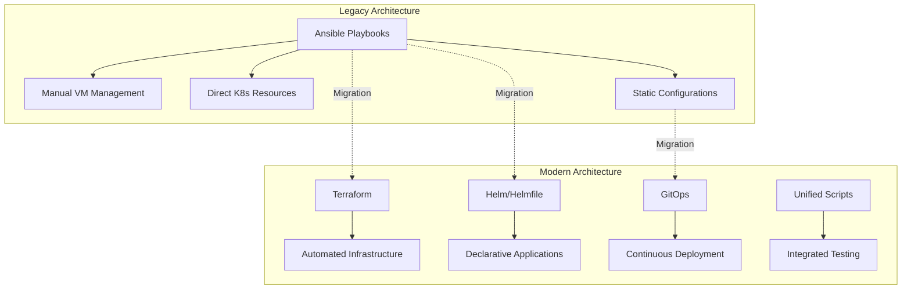

# Homelab Infrastructure Migration Guide

**Version:** 2.0  
**Date:** December 2024  
**Target Audience:** Infrastructure Engineers, DevOps Teams  

## Executive Summary

This guide provides step-by-step instructions for migrating from the legacy Ansible-based homelab infrastructure to the modernized Terraform + Helm + GitOps architecture. The migration maintains service continuity while introducing enhanced security, automation, and scalability.

## Migration Overview

### What's Changing

**From:** Ansible-based deployment → **To:** Terraform + Helm + GitOps
**Migration Strategy:** Parallel deployment with gradual cutover
**Downtime:** Zero-downtime migration with rollback capabilities
**Duration:** 4-6 weeks (can be parallelized)

### Architecture Evolution



## Pre-Migration Assessment

### 1. Current State Analysis

Before beginning migration, document your current infrastructure:

```bash
# Document current deployments
kubectl get all -A > current-deployments.yaml

# Export current configurations
kubectl get configmaps -A -o yaml > current-configmaps.yaml
kubectl get secrets -A -o yaml > current-secrets.yaml

# Document network configuration
kubectl get networkpolicies -A -o yaml > current-network-policies.yaml

# Export storage configuration
kubectl get pv,pvc -A -o yaml > current-storage.yaml
```

### 2. Environment Preparation

Create a testing environment to validate migrations:

```bash
# Create migration workspace
mkdir -p ~/homelab-migration/{backup,logs,configs}
cd ~/homelab-migration

# Clone the modernized repository
git clone https://github.com/tzervas/homelab-infra.git modernized
cd modernized

# Backup current configuration
cp -r /path/to/current/config backup/current-config-$(date +%Y%m%d)
```

### 3. Dependency Mapping

Identify service dependencies to plan migration order:

```bash
# Run dependency analysis
python3 scripts/testing/config_validator.py --analyze-dependencies
```

## Phase 1: Infrastructure Foundation (Weeks 1-2)

### 1.1 Terraform Infrastructure Setup

**Objective:** Establish Terraform-managed infrastructure alongside existing Ansible

**Duration:** 1 week

#### Step 1: Install Terraform and Initialize

```bash
# Install Terraform (if not already installed)
wget https://releases.hashicorp.com/terraform/1.6.0/terraform_1.6.0_linux_amd64.zip
unzip terraform_1.6.0_linux_amd64.zip
sudo mv terraform /usr/local/bin/

# Initialize Terraform workspace
cd terraform
terraform init
```

#### Step 2: Import Existing Infrastructure

```bash
# Import existing K3s cluster state
terraform import kubernetes_namespace.kube-system kube-system
terraform import kubernetes_namespace.metallb-system metallb-system

# Import current network configuration
terraform import kubernetes_config_map.metallb-config metallb-system/metallb-config
```

#### Step 3: Plan Infrastructure Changes

```bash
# Create initial Terraform plan
terraform plan -var="environment=development" -out=tfplan-phase1

# Review the plan carefully
terraform show tfplan-phase1
```

#### Step 4: Apply Infrastructure Changes (Parallel to Existing)

```bash
# Apply Terraform configuration
terraform apply tfplan-phase1

# Verify infrastructure state
terraform state list
kubectl get nodes
```

### 1.2 Network Infrastructure Migration

**Objective:** Migrate network configuration to Terraform management

#### Step 1: MetalLB Configuration Migration

```bash
# Export current MetalLB configuration
kubectl get configmap metallb-config -n metallb-system -o yaml > backup/metallb-config.yaml

# Apply new Terraform-managed MetalLB configuration
terraform apply -target=module.networking.helm_release.metallb

# Verify MetalLB functionality
kubectl get ipaddresspool -n metallb-system
kubectl get l2advertisement -n metallb-system
```

#### Step 2: DNS and Ingress Migration

```bash
# Migrate ingress controller configuration
terraform apply -target=module.networking.helm_release.ingress_nginx

# Test ingress functionality
curl -H "Host: test.homelab.local" http://192.168.25.240/
```

### 1.3 Validation and Testing

```bash
# Run comprehensive infrastructure tests
python3 scripts/testing/infrastructure_health.py --phase=infrastructure

# Validate network connectivity
python3 scripts/testing/network_security.py --test-connectivity

# Check Terraform state consistency
terraform plan -detailed-exitcode
```

## Phase 2: Security Infrastructure (Weeks 2-3)

### 2.1 Certificate Management Migration

**Objective:** Migrate from manual certificate management to automated cert-manager with Terraform

#### Step 1: Deploy cert-manager via Terraform

```bash
# Apply cert-manager configuration
terraform apply -target=module.security.helm_release.cert_manager

# Verify cert-manager installation
kubectl get pods -n cert-manager
kubectl get crd | grep cert-manager
```

#### Step 2: Migrate Existing Certificates

```bash
# Export existing certificates
kubectl get certificates -A -o yaml > backup/certificates.yaml
kubectl get issuers -A -o yaml > backup/issuers.yaml

# Apply new certificate issuers
kubectl apply -f deployments/security/tls-certificate-management.yaml

# Verify certificate issuers
kubectl get clusterissuers
kubectl describe clusterissuer letsencrypt-prod
```

#### Step 3: Certificate Validation

```bash
# Test certificate issuance
kubectl apply -f - <<EOF
apiVersion: cert-manager.io/v1
kind: Certificate
metadata:
  name: test-certificate
  namespace: default
spec:
  secretName: test-tls
  issuerRef:
    name: letsencrypt-staging
    kind: ClusterIssuer
  dnsNames:
  - test.homelab.local
EOF

# Monitor certificate status
kubectl get certificate test-certificate -w
kubectl describe certificate test-certificate
```

### 2.2 Secret Management Migration

**Objective:** Migrate to sealed secrets with automated rotation

#### Step 1: Deploy Sealed Secrets Controller

```bash
# Apply sealed secrets via Terraform
terraform apply -target=module.security.helm_release.sealed_secrets

# Verify sealed secrets controller
kubectl get pods -n kube-system | grep sealed-secrets
```

#### Step 2: Migrate Existing Secrets

```bash
# Export existing secrets (for reference only)
kubectl get secrets -A --field-selector type=Opaque -o yaml > backup/secrets.yaml

# Install kubeseal CLI
wget https://github.com/bitnami-labs/sealed-secrets/releases/download/v0.18.0/kubeseal-0.18.0-linux-amd64.tar.gz
tar -xvzf kubeseal-0.18.0-linux-amd64.tar.gz
sudo mv kubeseal /usr/local/bin

# Create sealed secrets for critical services
kubectl create secret generic gitlab-secrets \
  --from-literal=root-password="$(openssl rand -base64 32)" \
  --dry-run=client -o yaml | \
  kubeseal -o yaml > deployments/security/gitlab-sealed-secrets.yaml
```

#### Step 3: Secret Rotation Setup

```bash
# Apply secret rotation configuration
kubectl apply -f deployments/security/secret-rotation-mechanisms.yaml

# Verify rotation jobs
kubectl get cronjobs -A | grep rotation
```

### 2.3 Network Security Migration

**Objective:** Implement comprehensive network policies with mTLS

#### Step 1: Apply Base Network Policies

```bash
# Apply network policy templates
kubectl apply -f deployments/security/network-policy-templates.yaml

# Verify network policies
kubectl get networkpolicies -A
```

#### Step 2: mTLS Configuration (Optional - Istio Required)

```bash
# If using Istio service mesh
kubectl apply -f deployments/security/mtls-configuration.yaml

# Verify mTLS policies
kubectl get peerauthentication -A
kubectl get destinationrule -A
```

#### Step 3: Security Validation

```bash
# Run security compliance checks
python3 scripts/security/security-policy-compliance-checks.py --environment=development

# Validate TLS configuration
python3 scripts/security/tls-configuration-validation.py --check-all

# Test network policies
python3 scripts/testing/network_security.py --test-policies
```

## Phase 3: Application Migration (Weeks 3-4)

### 3.1 Helm Chart Migration

**Objective:** Migrate application deployments to Helmfile management

#### Step 1: Initialize Helmfile

```bash
cd helm

# Add required Helm repositories
helm repo add prometheus-community https://prometheus-community.github.io/helm-charts
helm repo add grafana https://grafana.github.io/helm-charts
helm repo add ingress-nginx https://kubernetes.github.io/ingress-nginx
helm repo add jetstack https://charts.jetstack.io
helm repo add metallb https://metallb.github.io/metallb
helm repo add longhorn https://charts.longhorn.io
helm repo update

# Validate Helmfile configuration
helmfile --environment development list
```

#### Step 2: Deploy Core Infrastructure Services

```bash
# Deploy in dependency order
helmfile --environment development --selector tier=infrastructure sync --wait

# Verify infrastructure services
kubectl get pods -n metallb-system
kubectl get pods -n cert-manager
kubectl get pods -n ingress-nginx
```

#### Step 3: Deploy Storage Layer

```bash
# Deploy storage services
helmfile --environment development --selector tier=storage sync --wait

# Verify storage deployment
kubectl get pods -n longhorn-system
kubectl get storageclass
```

#### Step 4: Deploy Monitoring Stack

```bash
# Deploy monitoring services
helmfile --environment development --selector tier=monitoring sync --wait

# Verify monitoring deployment
kubectl get pods -n monitoring
kubectl get servicemonitor -A
```

### 3.2 Data Migration and Validation

#### Step 1: Data Backup

```bash
# Backup Longhorn volumes
kubectl patch volumesnapshot -n longhorn-system migration-backup --type='merge' -p='{"spec":{"source":{"persistentVolumeClaimName":"*"}}}'

# Backup monitoring data
kubectl exec -n monitoring prometheus-0 -- tar czf /prometheus/backup-$(date +%Y%m%d).tar.gz /prometheus/data
```

#### Step 2: Service Validation

```bash
# Run comprehensive service validation
python3 scripts/testing/service_checker.py --environment=development

# Test service connectivity
python3 scripts/testing/integration_tester.py --test-all-services

# Validate data integrity
python3 scripts/testing/validate_deployment.py --check-data
```

## Phase 4: GitOps Integration (Weeks 4-5)

### 4.1 GitOps Setup

**Objective:** Implement GitOps workflows for continuous deployment

#### Step 1: Deploy ArgoCD (Recommended)

```bash
# Deploy ArgoCD via Helmfile
helmfile --environment development --selector name=argocd sync --wait

# Get ArgoCD admin password
kubectl -n argocd get secret argocd-initial-admin-secret -o jsonpath="{.data.password}" | base64 -d

# Access ArgoCD UI
kubectl port-forward svc/argocd-server -n argocd 8080:443
```

#### Step 2: Configure GitOps Applications

```bash
# Apply ArgoCD applications
kubectl apply -f deployments/gitops/argocd/app-of-apps.yaml

# Verify application deployment
kubectl get applications -n argocd
```

#### Step 3: Configure Flux (Alternative)

```bash
# Bootstrap Flux if preferred over ArgoCD
flux bootstrap github \
  --owner=tzervas \
  --repository=homelab-infra \
  --branch=main \
  --path=deployments/gitops/flux

# Apply Flux configurations
kubectl apply -f deployments/gitops/flux/clusters/homelab/
```

### 4.2 Drift Detection and Remediation

```bash
# Apply drift detection policies
kubectl apply -f deployments/gitops/policies/drift-detection.yaml

# Configure automated remediation
kubectl apply -f deployments/gitops/policies/gatekeeper-policies.yaml
```

## Phase 5: Unified Deployment & Testing (Weeks 5-6)

### 5.1 Unified Deployment Script

**Objective:** Implement unified deployment workflow

#### Step 1: Deploy Using Unified Script

```bash
# Test unified deployment script
./scripts/deployment/deploy-unified.sh --dry-run --environment development

# Full deployment
./scripts/deployment/deploy-unified.sh --environment development

# Monitor deployment progress
watch kubectl get pods -A
```

#### Step 2: Validate Unified Deployment

```bash
# Comprehensive testing
./run-tests.sh --full --environment development

# Specific test modules
python3 scripts/testing/integrated_test_orchestrator.py
```

### 5.2 Performance and Load Testing

```bash
# Run performance benchmarks
python3 testing/performance/benchmarks.py --environment development

# Load testing
kubectl apply -f testing/load-testing/
```

### 5.3 Documentation Update

```bash
# Generate updated documentation
python3 scripts/utilities/generate-docs.py --update-migration-status

# Update service documentation
for service in gitlab keycloak monitoring; do
  kubectl describe deployment $service > docs/services/$service-config.md
done
```

## Post-Migration Tasks

### 1. Legacy Cleanup

**⚠️ CRITICAL: Only perform after successful validation**

```bash
# Archive legacy Ansible playbooks
mkdir -p ansible/legacy-migration
mv ansible/deploy-*.yml ansible/legacy-migration/

# Update documentation
echo "# Legacy Migration Complete" > ansible/legacy-migration/MIGRATION_COMPLETE.md
echo "Date: $(date)" >> ansible/legacy-migration/MIGRATION_COMPLETE.md
echo "Migrated playbooks archived for reference only" >> ansible/legacy-migration/MIGRATION_COMPLETE.md
```

### 2. Monitoring and Alerting Updates

```bash
# Update monitoring for new architecture
kubectl apply -f monitoring/migration-metrics.yaml

# Configure alerts for new components
kubectl apply -f monitoring/terraform-alerts.yaml
kubectl apply -f monitoring/helmfile-alerts.yaml
```

### 3. Backup Strategy Updates

```bash
# Update backup scripts for new architecture
./scripts/maintenance/update-backup-strategy.sh

# Test backup and restore procedures
./scripts/testing/test-backup-restore.sh --environment development
```

## Troubleshooting Guide

### Common Migration Issues

#### 1. Terraform State Conflicts

**Symptoms:** Resource already exists errors
**Solution:**
```bash
# Import existing resource
terraform import kubernetes_namespace.example default

# Or remove from state if recreating
terraform state rm kubernetes_namespace.example
```

#### 2. Helm Release Conflicts

**Symptoms:** Release already exists errors
**Solution:**
```bash
# Check existing releases
helm list -A

# Upgrade existing release
helm upgrade --reuse-values release-name chart-name

# Or force replacement
helm delete release-name
helmfile --environment development sync
```

#### 3. Certificate Issues

**Symptoms:** Certificate not being issued
**Solution:**
```bash
# Check cert-manager status
kubectl describe certificate problem-cert
kubectl logs -n cert-manager -l app=cert-manager

# Common fixes
kubectl annotate certificate problem-cert cert-manager.io/force-renew=true
```

#### 4. Network Policy Blocking Traffic

**Symptoms:** Services cannot communicate
**Solution:**
```bash
# Temporarily disable policies for debugging
kubectl label namespace target-namespace network-policy=disabled

# Check policy details
kubectl describe networkpolicy -n target-namespace
```

#### 5. GitOps Sync Issues

**Symptoms:** Applications not syncing
**Solution:**
```bash
# Force sync in ArgoCD
argocd app sync app-name --force

# Check application status
argocd app get app-name
kubectl describe application app-name -n argocd
```

### Emergency Rollback Procedures

#### Quick Rollback to Ansible

```bash
# Stop new deployments
kubectl scale deployment argocd-server -n argocd --replicas=0

# Restore from backup
kubectl apply -f backup/critical-services/

# Re-enable Ansible playbooks
cd ~/homelab-migration/backup/current-config-*
ansible-playbook site.yml
```

#### Partial Rollback

```bash
# Rollback specific service
helm rollback service-name 1

# Rollback Terraform resource
terraform import kubernetes_deployment.service backup-config
```

## Validation Checklist

### Pre-Migration Checklist

- [ ] Complete backup of current configuration
- [ ] Test environment prepared and validated
- [ ] All dependencies documented
- [ ] Migration timeline communicated
- [ ] Rollback procedures tested

### Post-Migration Checklist

- [ ] All services running and accessible
- [ ] Monitoring and alerting functional
- [ ] Security policies applied and tested
- [ ] Performance benchmarks meet expectations
- [ ] Documentation updated
- [ ] Team training completed
- [ ] Legacy components archived

### Ongoing Validation

- [ ] Weekly infrastructure health checks
- [ ] Monthly security compliance scans
- [ ] Quarterly disaster recovery tests
- [ ] Semi-annual architecture reviews

## Performance Monitoring

### Key Metrics to Monitor

```bash
# Infrastructure metrics
kubectl top nodes
kubectl top pods -A

# Application metrics
curl http://prometheus.homelab.local/api/v1/query?query=up

# Security metrics
kubectl get networkpolicies -A
kubectl get certificates -A
```

### Performance Benchmarks

| Metric | Pre-Migration | Post-Migration | Target |
|--------|---------------|----------------|---------|
| Pod startup time | 45s | 30s | <30s |
| Service discovery | 15s | 5s | <10s |
| Certificate issuance | Manual | 2m | <5m |
| Backup completion | 1h | 20m | <30m |

## Training and Knowledge Transfer

### Team Training Requirements

1. **Terraform Fundamentals** (8 hours)
   - Infrastructure as Code concepts
   - Terraform syntax and best practices
   - State management and remote backends

2. **Helm and Helmfile** (4 hours)
   - Chart development and customization
   - Helmfile environment management
   - Troubleshooting deployment issues

3. **GitOps Workflows** (4 hours)
   - ArgoCD/Flux operation
   - Git-based deployment workflows
   - Drift detection and remediation

### Documentation Requirements

- [ ] Updated deployment procedures
- [ ] Troubleshooting runbooks
- [ ] Security operational procedures
- [ ] Disaster recovery playbooks

## Success Criteria

### Technical Success Metrics

- [ ] Zero unplanned downtime during migration
- [ ] All services migrated successfully
- [ ] Performance improvements achieved
- [ ] Security posture enhanced
- [ ] Automated testing coverage >90%

### Operational Success Metrics

- [ ] Deployment time reduced by >50%
- [ ] Mean time to recovery (MTTR) improved
- [ ] Configuration drift eliminated
- [ ] Manual intervention reduced by >80%
- [ ] Team productivity increased

## Conclusion

This migration guide provides a comprehensive roadmap for modernizing your homelab infrastructure. The phased approach minimizes risk while maximizing the benefits of modern infrastructure management practices.

**Key Benefits Achieved:**
- Enhanced security with automated certificate management and mTLS
- Improved reliability through Infrastructure as Code
- Increased automation reducing manual operations
- Better observability and monitoring capabilities
- Scalable architecture for future growth

**Next Steps:**
1. Review and approve migration plan
2. Prepare test environment
3. Begin Phase 1 implementation
4. Monitor progress and adjust timeline as needed
5. Conduct lessons learned session post-migration

---

**Migration Guide Version:** 2.0  
**Last Updated:** December 2024  
**Next Review:** Post-implementation  
**Contact:** tz-dev@vectorweight.com

