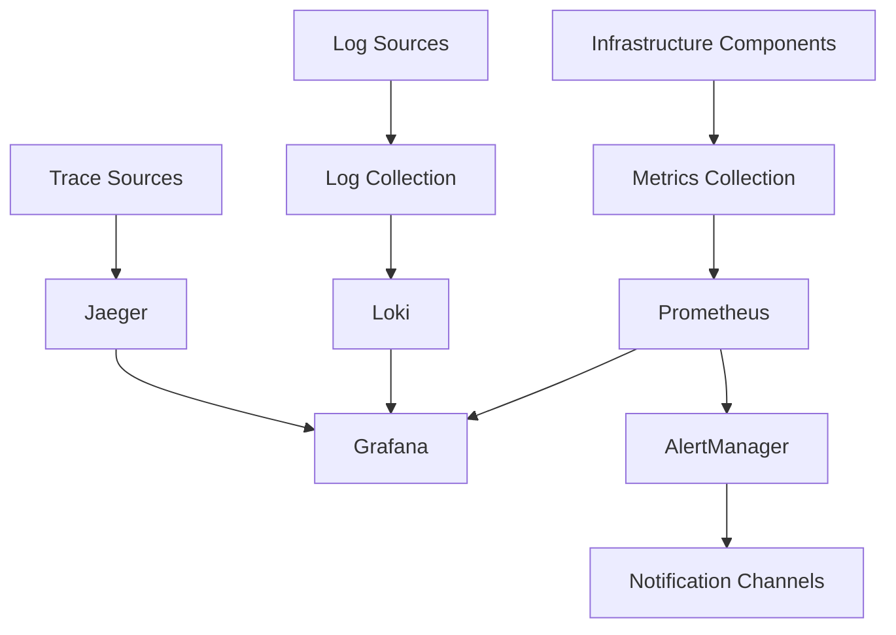

# Monitoring Infrastructure

Comprehensive monitoring, observability, and alerting infrastructure for the homelab environment.

## Overview

This directory contains monitoring infrastructure components that provide visibility into the health, performance, and security of the entire homelab stack.

## Structure

```
monitoring/
├── README.md                  # This documentation
└── terraform-state/          # Terraform state monitoring
    └── terraform-state-monitor.py  # State drift detection tool
```

## Components

### Terraform State Monitoring

**Purpose**: Monitor Terraform state files for drift detection and compliance tracking.

**Features**:

- Real-time state change detection
- Drift analysis and reporting
- Configuration compliance monitoring
- Automated alerting for unauthorized changes

**Usage**:

```bash
# Monitor specific state file
./monitoring/terraform-state/terraform-state-monitor.py \
    --state-file terraform/terraform.tfstate \
    --config monitoring-config.yaml

# Continuous monitoring mode
./monitoring/terraform-state/terraform-state-monitor.py \
    --watch \
    --interval 300 \
    --state-dir terraform/
```

## Integration Points

### Prometheus Integration

The monitoring infrastructure integrates with the Prometheus stack deployed via Helm:

```yaml
# ServiceMonitor for custom metrics
apiVersion: monitoring.coreos.com/v1
kind: ServiceMonitor
metadata:
  name: homelab-monitoring
  namespace: monitoring
spec:
  selector:
    matchLabels:
      app: homelab-monitor
  endpoints:
  - port: metrics
    interval: 30s
    path: /metrics
```

### Grafana Dashboards

Custom dashboards for homelab-specific metrics:

- **Infrastructure Overview**: High-level system health
- **Terraform State**: Infrastructure drift and changes
- **Deployment Tracking**: Application deployment status
- **Security Monitoring**: Security events and compliance

### AlertManager Rules

Custom alerting rules for homelab-specific scenarios:

```yaml
groups:
- name: homelab.rules
  rules:
  - alert: TerraformStateDrift
    expr: terraform_state_drift > 0
    for: 5m
    labels:
      severity: warning
    annotations:
      summary: "Terraform state drift detected"
      description: "Infrastructure drift detected in {{ $labels.state_file }}"
```

## Monitoring Stack Architecture

### Data Flow



### Metrics Collection

#### System Metrics

- Node exporter for host-level metrics
- cAdvisor for container metrics
- Kubernetes metrics from kube-state-metrics

#### Application Metrics

- Custom application metrics via `/metrics` endpoints
- Business logic metrics
- Performance indicators

#### Infrastructure Metrics

- Kubernetes cluster health
- Storage utilization and performance
- Network performance and connectivity
- Load balancer statistics

### Log Aggregation

#### Log Sources

- Kubernetes pod logs
- System logs from nodes
- Application-specific logs
- Audit logs for security events

#### Log Processing

- Structured logging with JSON format
- Log parsing and enrichment
- Log retention policies
- Log-based alerting

### Distributed Tracing

#### Trace Collection

- OpenTelemetry instrumentation
- Service mesh tracing (if enabled)
- Custom trace spans for business logic

## Custom Monitoring Components

### Health Check Framework

Comprehensive health checking for all infrastructure components:

```python
from monitoring.health import HealthChecker

# Initialize health checker
checker = HealthChecker()

# Register health checks
checker.register("kubernetes", kubernetes_health_check)
checker.register("storage", storage_health_check)
checker.register("network", network_health_check)

# Run health checks
results = checker.run_all()
```

### Metric Collectors

Custom metric collectors for homelab-specific data:

- **Deployment Metrics**: Track deployment frequency and success rates
- **Resource Utilization**: Monitor resource usage patterns
- **Security Metrics**: Track security events and compliance status
- **Performance Metrics**: Application and infrastructure performance

### Alerting Framework

Intelligent alerting system with:

- **Context-aware alerts**: Reduce noise with intelligent grouping
- **Escalation policies**: Automated escalation based on severity
- **Integration hooks**: Custom notification channels
- **Alert correlation**: Related alert detection and grouping

## Configuration

### Monitoring Configuration

Central configuration for monitoring components:

```yaml
# monitoring-config.yaml
monitoring:
  prometheus:
    retention: "30d"
    scrape_interval: "15s"
    external_labels:
      cluster: "homelab"
      environment: "production"

  grafana:
    admin_user: "admin"
    datasources:
      - name: "Prometheus"
        type: "prometheus"
        url: "http://prometheus:9090"
      - name: "Loki"
        type: "loki"
        url: "http://loki:3100"

  alertmanager:
    global:
      smtp_smarthost: "localhost:587"
      smtp_from: "alerts@homelab.local"

    routes:
      - match:
          severity: "critical"
        receiver: "critical-alerts"
      - match:
          severity: "warning"
        receiver: "warning-alerts"

    receivers:
      - name: "critical-alerts"
        email_configs:
          - to: "admin@homelab.local"
            subject: "Critical Alert: {{ .GroupLabels.alertname }}"
      - name: "warning-alerts"
        email_configs:
          - to: "ops@homelab.local"
            subject: "Warning: {{ .GroupLabels.alertname }}"

custom_monitors:
  terraform_state:
    enabled: true
    check_interval: "5m"
    state_files:
      - "terraform/terraform.tfstate"
      - "terraform/environments/*/terraform.tfstate"

  certificate_expiry:
    enabled: true
    check_interval: "1h"
    warning_days: 30
    critical_days: 7

  backup_validation:
    enabled: true
    check_interval: "1d"
    retention_days: 30
```

### Dashboard Configuration

Automated dashboard provisioning:

```yaml
# grafana-dashboards.yaml
dashboards:
  - name: "Homelab Overview"
    file: "dashboards/homelab-overview.json"
    folder: "Homelab"

  - name: "Infrastructure Health"
    file: "dashboards/infrastructure-health.json"
    folder: "Infrastructure"

  - name: "Application Performance"
    file: "dashboards/application-performance.json"
    folder: "Applications"
```

## Security Monitoring

### Security Metrics

Comprehensive security monitoring including:

- **Authentication Events**: Login attempts and failures
- **Authorization Violations**: RBAC policy violations
- **Network Security**: Suspicious network activity
- **Resource Access**: Unauthorized resource access attempts
- **Configuration Changes**: Infrastructure and application changes

### Compliance Monitoring

Automated compliance checking for:

- **Security Policies**: Pod Security Standards compliance
- **Network Policies**: Network segmentation compliance
- **Resource Policies**: Resource usage compliance
- **Backup Policies**: Backup execution and retention compliance

### Security Alerting

Specialized security alerts for:

- **Intrusion Detection**: Suspicious activity patterns
- **Policy Violations**: Security policy breaches
- **Certificate Expiry**: TLS certificate expiration warnings
- **Vulnerability Detection**: Security vulnerability alerts

## Performance Monitoring

### Application Performance Monitoring (APM)

Comprehensive APM including:

- **Response Time Tracking**: API and web response times
- **Error Rate Monitoring**: Application error rates and types
- **Throughput Analysis**: Request volume and patterns
- **Resource Utilization**: CPU, memory, and I/O usage

### Infrastructure Performance

Infrastructure-level performance monitoring:

- **Cluster Performance**: Kubernetes cluster metrics
- **Storage Performance**: Disk I/O and storage metrics
- **Network Performance**: Network latency and throughput
- **Load Balancer Performance**: Traffic distribution and health

### Capacity Planning

Automated capacity planning with:

- **Resource Trend Analysis**: Historical resource usage trends
- **Growth Prediction**: Predictive capacity modeling
- **Scaling Recommendations**: Automated scaling suggestions
- **Cost Optimization**: Resource optimization recommendations

## Troubleshooting

### Common Monitoring Issues

#### Prometheus Not Scraping Targets

```bash
# Check Prometheus targets
kubectl port-forward -n monitoring service/prometheus 9090:9090
# Visit http://localhost:9090/targets

# Check service discovery
kubectl get servicemonitors -A
kubectl describe servicemonitor <monitor-name> -n <namespace>
```

#### Grafana Dashboard Issues

```bash
# Check Grafana logs
kubectl logs -n monitoring deployment/grafana

# Check datasource configuration
kubectl get configmap grafana-datasources -n monitoring -o yaml

# Test datasource connectivity
kubectl exec -n monitoring deployment/grafana -- \
  curl -v http://prometheus:9090/api/v1/query?query=up
```

#### AlertManager Not Sending Alerts

```bash
# Check AlertManager configuration
kubectl get secret alertmanager-config -n monitoring -o yaml

# Check alert rules
kubectl get prometheusrules -A

# Test alert routing
kubectl port-forward -n monitoring service/alertmanager 9093:9093
# Visit http://localhost:9093
```

### Debug Commands

```bash
# Check monitoring stack status
kubectl get pods -n monitoring

# Check custom monitor status
./monitoring/terraform-state/terraform-state-monitor.py --status

# Validate monitoring configuration
kubectl apply --dry-run=server -f monitoring/config/

# Check metrics endpoint
curl http://prometheus.monitoring.svc.cluster.local:9090/metrics
```

## Development

### Adding Custom Monitors

1. **Create Monitor Script**: Implement monitor in appropriate language
2. **Define Metrics**: Expose metrics via `/metrics` endpoint
3. **Create ServiceMonitor**: Configure Prometheus scraping
4. **Add Dashboard**: Create Grafana dashboard for visualization
5. **Configure Alerts**: Define relevant alerting rules

### Monitor Development Framework

```python
from monitoring.framework import Monitor, Metric

class CustomMonitor(Monitor):
    def __init__(self, config):
        super().__init__(config)
        self.metrics = {
            'custom_metric': Metric('gauge', 'Custom metric description'),
            'custom_counter': Metric('counter', 'Custom counter description')
        }

    def collect_metrics(self):
        # Implement metric collection logic
        self.metrics['custom_metric'].set(self.get_custom_value())
        self.metrics['custom_counter'].inc()

    def health_check(self):
        # Implement health check logic
        return True
```

### Testing Monitors

```bash
# Unit tests for monitors
python -m pytest monitoring/tests/

# Integration tests
./monitoring/tests/integration-test.sh

# Load testing for metric endpoints
./monitoring/tests/load-test.sh
```

## Deployment

### Helm Integration

Deploy monitoring components via Helm:

```bash
# Deploy Prometheus stack
helm install prometheus-stack prometheus-community/kube-prometheus-stack \
  -n monitoring \
  -f monitoring/config/prometheus-values.yaml

# Deploy custom monitors
helm install custom-monitors ./monitoring/helm-chart \
  -n monitoring \
  -f monitoring/config/custom-monitors-values.yaml
```

### GitOps Integration

Deploy via ArgoCD or Flux:

```yaml
apiVersion: argoproj.io/v1alpha1
kind: Application
metadata:
  name: monitoring-stack
  namespace: argocd
spec:
  source:
    repoURL: https://github.com/your-org/homelab-infra
    path: monitoring/manifests
    targetRevision: main
  destination:
    server: https://kubernetes.default.svc
    namespace: monitoring
  syncPolicy:
    automated:
      prune: true
      selfHeal: true
```

## Backup and Recovery

### Monitoring Data Backup

- **Prometheus Data**: Long-term storage and backup
- **Grafana Configuration**: Dashboard and datasource backup
- **Alert History**: Alert event archival
- **Custom Monitor Configuration**: Configuration backup

### Disaster Recovery

- **Monitoring Stack Recovery**: Restore monitoring infrastructure
- **Historical Data Recovery**: Restore metric and log data
- **Dashboard Recovery**: Restore custom dashboards
- **Alert Configuration Recovery**: Restore alerting rules

## Best Practices

### Monitoring Design Principles

1. **Comprehensive Coverage**: Monitor all critical components
2. **Meaningful Metrics**: Focus on actionable metrics
3. **Efficient Collection**: Optimize metric collection overhead
4. **Scalable Architecture**: Design for growth and scale
5. **Security Focus**: Monitor security-relevant events

### Alerting Best Practices

1. **Alert Fatigue Prevention**: Minimize false positives
2. **Context-Rich Alerts**: Provide actionable information
3. **Escalation Policies**: Define clear escalation paths
4. **Documentation**: Document alert response procedures
5. **Regular Review**: Regularly review and tune alerts

### Dashboard Design

1. **User-Focused**: Design for specific user needs
2. **Hierarchical Structure**: Provide overview and detail views
3. **Consistent Layout**: Use consistent design patterns
4. **Performance Optimized**: Optimize dashboard query performance
5. **Mobile Friendly**: Ensure mobile accessibility

## Future Enhancements

### Planned Features

1. **AI-Powered Alerting**: Machine learning for intelligent alerting
2. **Automated Remediation**: Self-healing infrastructure
3. **Advanced Analytics**: Predictive analytics and anomaly detection
4. **Cost Monitoring**: Infrastructure cost tracking and optimization
5. **Service Mesh Observability**: Deep service mesh monitoring

### Integration Roadmap

1. **OpenTelemetry**: Full OpenTelemetry instrumentation
2. **Service Mesh**: Istio/Linkerd observability integration
3. **Cloud Integration**: Multi-cloud monitoring support
4. **Edge Monitoring**: Edge device and remote site monitoring
5. **Compliance Automation**: Automated compliance reporting

## Related Documentation

- [Helm Monitoring Charts](../helm/charts/monitoring/README.md)
- [Kubernetes Monitoring Manifests](../kubernetes/monitoring/README.md)
- [Security Monitoring Guide](../docs/security/monitoring.md)
- [Operations Runbooks](../docs/operations/runbooks/README.md)
- [Troubleshooting Guide](../docs/troubleshooting/README.md)
