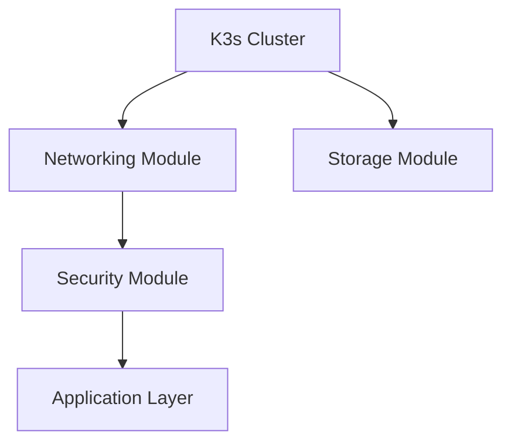

# Terraform Infrastructure for Homelab

This directory contains the Terraform infrastructure-as-code for the homelab project, providing comprehensive K3s cluster management, networking, security, and storage configurations.

## Directory Structure

```
terraform/
├── modules/                    # Reusable Terraform modules
│   ├── k3s-cluster/           # K3s cluster provisioning and configuration
│   ├── networking/            # MetalLB, ingress, DNS configuration
│   ├── security/              # Cert-manager, secrets, RBAC, security policies
│   └── storage/               # Storage classes, provisioners, PVCs
├── environments/              # Environment-specific configurations
│   ├── development/           # Development environment
│   ├── staging/               # Staging environment
│   └── production/            # Production environment
├── providers/                 # Custom providers for homelab-specific resources
├── main.tf                    # Root Terraform configuration
└── README.md                  # This file
```

## Features

### K3s Cluster Module

- Automated K3s installation and configuration
- Configurable cluster networking (CIDR, DNS)
- Node labeling and tainting support
- Rootless mode support
- Custom component disabling (traefik, servicelb)
- Installation script generation
- Cluster status monitoring

### Networking Module

- MetalLB load balancer with configurable IP pools
- L2 advertisement configuration
- NGINX Ingress Controller with SSL passthrough
- Custom CoreDNS configuration
- Network policies for security
- Service mesh integration (Istio/Linkerd)
- VLAN support with Multus CNI

### Security Module

- Cert-Manager for SSL certificate management
- Let's Encrypt integration (staging and production)
- External Secrets Operator integration
- Sealed Secrets Controller
- RBAC configuration with custom roles
- Pod Security Standards enforcement
- Network security policies
- Falco runtime security monitoring

### Storage Module

- Local Path Provisioner for local storage
- Multiple storage classes (standard, fast-SSD)
- NFS provisioner support
- Automated PVC creation
- Storage namespace management

## Usage

### Prerequisites

1. **Terraform**: Install Terraform >= 1.0
2. **kubectl**: Install kubectl for Kubernetes management
3. **Helm**: Install Helm for chart management
4. **K3s**: Either have K3s installed or use the module to install it

### Quick Start

1. **Initialize Terraform**:

   ```bash
   cd terraform
   terraform init
   ```

2. **Plan the deployment**:

   ```bash
   # For development environment (default)
   terraform plan

   # For specific environment
   terraform plan -var="environment=staging"
   ```

3. **Apply the configuration**:

   ```bash
   # Deploy development environment
   terraform apply

   # Deploy specific environment
   terraform apply -var="environment=staging"
   ```

4. **Verify the deployment**:

   ```bash
   kubectl get nodes
   kubectl get pods -A
   ```

### Environment-Specific Deployment

#### Development Environment

```bash
cd terraform/environments/development
terraform init
terraform plan
terraform apply
```

#### Production Environment

```bash
cd terraform/environments/production
terraform init
terraform plan
terraform apply
```

### Configuration

#### MetalLB IP Pools

Configure IP pools in the environment variables:

```hcl
metallb_ip_pools = {
  development = {
    addresses = ["192.168.1.240-192.168.1.245"]
  }
  production = {
    addresses = ["192.168.1.246-192.168.1.250"]
  }
}
```

#### SSL Certificates

Enable cert-manager and Let's Encrypt:

```hcl
enable_cert_manager = true
enable_letsencrypt = true
letsencrypt_email = "admin@yourdomain.com"
```

#### Storage Configuration

Configure storage classes and provisioners:

```hcl
enable_local_path_provisioner = true
set_local_path_default = true
enable_fast_ssd_class = true
fast_ssd_path = "/mnt/fast-ssd"
```

## Integration with Existing Config Structure

The Terraform modules integrate seamlessly with the existing `config/environments/` structure:

- Configuration files are generated in `config/environments/{environment}/`
- Service discovery information is maintained
- Kubernetes manifests are coordinated with Terraform resources
- Environment-specific overrides are supported

## Module Dependencies



## Security Considerations

### Development Environment

- Minimal security policies
- Network policies disabled for easier debugging
- No runtime security monitoring
- Self-signed certificates

### Production Environment

- Full security policy enforcement
- Network isolation with policies
- Runtime security with Falco
- Let's Encrypt certificates
- External secrets management

## Customization

### Adding New Modules

1. Create module directory under `modules/`
2. Define variables, resources, and outputs
3. Add module to environment configurations
4. Update documentation

### Environment Customization

1. Modify variables in `environments/{env}/variables.tf`
2. Override module configurations as needed
3. Add environment-specific resources
4. Test with `terraform plan`

## Troubleshooting

### Common Issues

1. **K3s Installation Fails**:

   ```bash
   # Check installation script
   cat terraform/modules/k3s-cluster/k3s-install.sh

   # Run manually for debugging
   bash terraform/modules/k3s-cluster/k3s-install.sh
   ```

2. **MetalLB Not Getting IPs**:

   ```bash
   # Check IP pool configuration
   kubectl get ipaddresspool -n metallb-system
   kubectl get l2advertisement -n metallb-system
   ```

3. **Ingress Not Working**:

   ```bash
   # Check ingress controller
   kubectl get pods -n ingress-nginx
   kubectl logs -n ingress-nginx -l app.kubernetes.io/name=ingress-nginx
   ```

### Debugging Commands

```bash
# Check Terraform state
terraform state list
terraform state show <resource>

# Validate configuration
terraform validate
terraform fmt -check

# Plan with detailed output
terraform plan -detailed-exitcode

# Apply with debugging
TF_LOG=DEBUG terraform apply
```

## Contributing

When contributing to the Terraform infrastructure:

1. Follow Terraform best practices
2. Use consistent naming conventions
3. Add proper variable validation
4. Include comprehensive documentation
5. Test in development environment first
6. Update this README with any changes

## Version Compatibility

- **Terraform**: >= 1.0
- **Kubernetes**: >= 1.24 (via K3s)
- **K3s**: >= 1.28
- **Helm**: >= 3.8

For specific provider versions, see the individual module requirements.

<citations>
<document>
<document_type>RULE</document_type>
<document_id>VbwJPOrEQyc6WZkaBDKsQ1</document_id>
</document>
<document>
<document_type>RULE</document_type>
<document_id>7YGKIaE8LQu3fpLsZowXJ4</document_id>
</document>
<document>
<document_type>RULE</document_type>
<document_id>uBcUbZ9hxugV2CEF7tJhRW</document_id>
</document>
<document>
<document_type>RULE</document_type>
<document_id>MP1Tz7EadM7yuauFU0MzKt</document_id>
</document>
</citations>
